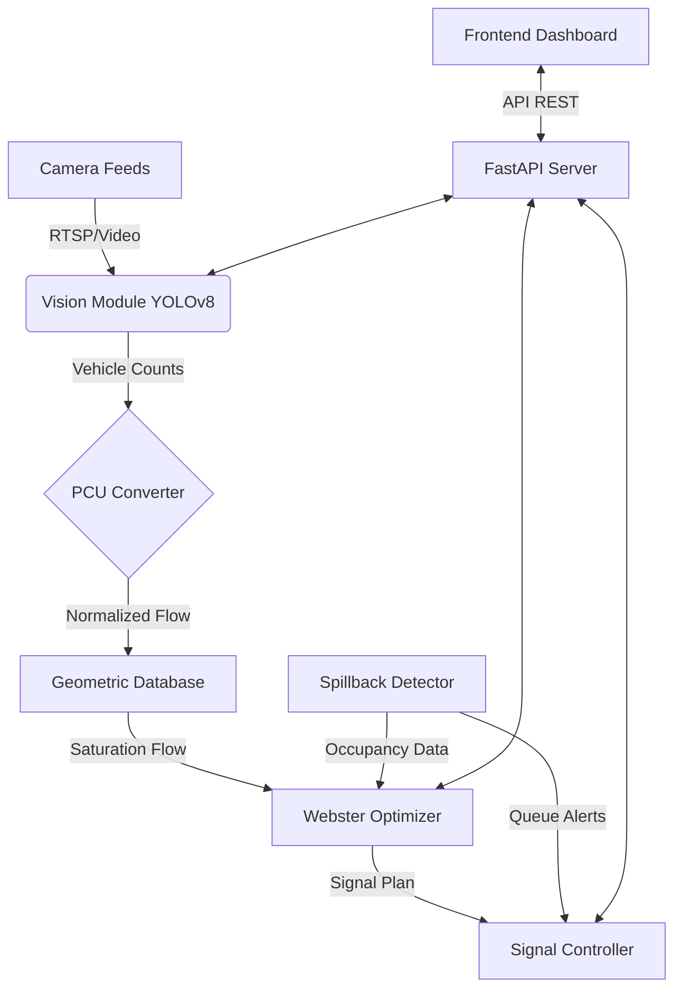

# Traffic Management System
**Geometry-Aware Intelligent Traffic Signal Optimization**

[](tests/)
[](https://www.python.org/)
[](https://reactjs.org/)
[](LICENSE)

> **Built for Vadodara Smart City Hackathon 2026**

---

## 🏆 Team: PU132 IT BUSTERS

| Role | Name |
|------|------|
| **Team Leader** | Rishit Bhowmick |
| **Developer** | Hemal Bhatt |
| **Developer** | Krushal Hirpara |
| **Developer** | Ayush Chabhadiya |

---

## 📖 Executive Summary

Urban traffic congestion is a critical issue affecting smart cities, leading to increased travel time, fuel consumption, and environmental pollution. Traditional fixed-timer signals fail to adapt to real-time traffic dynamics.

**Our Solution** is an advanced, AI-powered Traffic Management System that integrates **Computer Vision**, **Geometry-Aware Optimization**, and **Real-Time Signal Control**. Unlike standard adaptive systems, our approach considers the *physical geometry* of intersections (lane widths, turn radii) and the *heterogeneous nature* of Indian traffic (converting all vehicle types to PCU) to minimize wait times and prevent gridlock.

---

## 🚀 Key Innovations

### 1. Geometry-Aware Optimization
We don't just count cars; we understand the road. Our system calculates saturation flow rates based on:
*   **Lane Widths**: Adjusting for narrow vs. wide lanes.
*   **Turn Radii**: Accounting for slower turning speeds.
*   **Gradient**: Adjusting for uphill/downhill effects.

### 2. Heterogeneous Traffic Handling (IRC Standards)
Using our custom `PCU Converter`, we normalize diverse traffic (cars, trucks, motorcycles, auto-rickshaws) into a standard unit (Passenger Car Units) following Indian Roads Congress (IRC) guidelines, ensuring accurate signal timing for mixed traffic conditions.

### 3. Proactive Spillback Prevention
The system continuously monitors downstream lane occupancy. If a potential gridlock (spillback) is detected, it automatically adjusts upstream green times to prevent blocking the intersection.

---

## 🛠️ Technology Stack

### Backend
*   **Framework**: FastAPI (Python) - High performance, async support.
*   **Computer Vision**: YOLOv8 (Ultralytics) - Real-time vehicle detection.
*   **Optimization**: Custom Webster's Algorithm implementation.
*   **Testing**: Pytest (100% coverage on core algorithms).

### Frontend
*   **Framework**: React.js (Vite) - Fast, modern UI.
*   **Styling**: Tailwind CSS - Responsive, clean design.
*   **Visualization**: Recharts & Leaflet maps for real-time analytics.

### Data & Simulation
*   **Storage**: In-memory optimized geometric database.
*   **Simulation**: Compatible with SUMO (Simulation of Urban MObility).

---

## 🏗️ System Architecture



---

## ✨ Core Features

### 🚦 Advanced Signal Control
*   **Adaptive Timing**: Cycles adjust dynamically (30s - 120s) based on demand.
*   **Green Wave**: Coordinates signals along a corridor to reduce stops.
*   **Emergency Preemption**: Clears paths for ambulances/fire trucks (API ready).

### 📹 Intelligent Vision
*   **Real-time Detection**: Identifies 6+ vehicle classes.
*   **Queue Estimation**: Calculates queue lengths from visual data.
*   **Low Latency**: Optimized inference running at ~150ms/frame on CPU.

### 📊 Interactive Dashboard
*   **Live Monitoring**: View active signal phases and traffic flow.
*   **Analytics**: Historical performance, peak hour analysis, and efficiency metrics.
*   **Manual Override**: Operator control for emergencies.

---

## 💻 Installation & Setup

### Prerequisites
*   Python 3.10+
*   Node.js 18+

### 1. Clone the Repository
```bash
git clone https://github.com/your-repo/traffic-anti.git
cd traffic-anti
```

### 2. Backend Setup
```bash
# Create virtual environment
python -m venv venv
# Windows
venv\Scripts\activate
# Linux/Mac
source venv/bin/activate

# Install dependencies
pip install -r requirements.txt

# Run the API Server
uvicorn api.main:app --reload
```
*Backend runs at: `http://localhost:8000`*

### 3. Frontend Setup
```bash
cd frontend

# Install dependencies
npm install

# Start Development Server
npm run dev
```
*Frontend runs at: `http://localhost:5173`*

---

## 🔌 API Documentation

| Method | Endpoint | Description |
|--------|----------|-------------|
| `POST` | `/optimize/{junction_id}` | Calculate optimal signal timings. |
| `POST` | `/spillback/{junction_id}` | Check for gridlock capability. |
| `POST` | `/pcu/convert` | Convert vehicle counts to PCU. |
| `GET`  | `/vision/process/{id}` | Process video feed for a junction. |

**Example: Optimize Signal**
```bash
curl -X POST http://localhost:8000/optimize/J001 \
  -H "Content-Type: application/json" \
  -d '{"north": 800, "south": 750, "east": 1200, "west": 1100}'
```

---

## 📈 Impact Analysis

Implementing this system in a city like Vadodara is projected to achieve:
*   **20-30% Reduction** in average waiting time.
*   **15% Decrease** in carbon emissions due to reduced idling.
*   **Improved Safety** via reduced weaving and spillback incidents.

---

## 🔮 Future Roadmap

*   [ ] **Reinforcement Learning**: Move from Webster's to RL (PPO/DQN) for multi-agent coordination.
*   [ ] **V2X Communication**: Direct vehicle-to-infrastructure data exchange.
*   [ ] **Edge Deployment**: Porting vision module to Jetson Nano/Raspberry Pi.

---

## 🤝 Contributing

We welcome contributions! Please fork the repo and submit a PR.
1. Fork it
2. Create your feature branch (`git checkout -b feature/AmazingFeature`)
3. Commit your changes (`git commit -m 'Add some AmazingFeature'`)
4. Push to the branch (`git push origin feature/AmazingFeature`)
5. Open a Pull Request

---

## 📄 License
Distributed under the MIT License. See `LICENSE` for more information.

---

