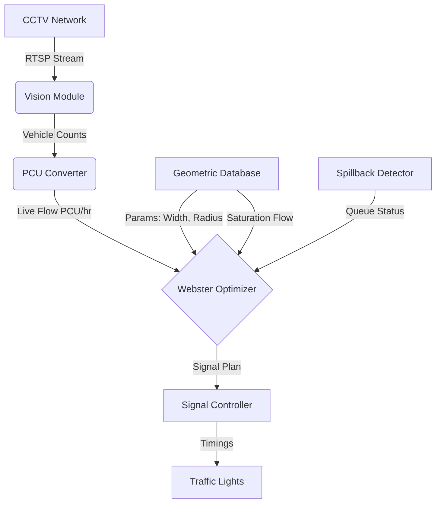

# Traffic Management System Documentation

## 1. Project Overview

**Project Name:** Geometry-Aware Intelligent Traffic Signal Optimization for Vadodara Smart City  
**Type:** Advanced Traffic Management System (ATMS)  
**Core Innovation:** Software-only solution utilizing existing CCTV infrastructure to optimize signal timings based on real-time traffic demand and precise junction geometry.

### Problem Statement
Vadodara faces severe traffic congestion due to:
*   **Geometric Constraints:** Narrow lanes (2.5-3.0m) in the old city and tight turning radii.
*   **Fixed Signal Timings:** Pre-timed controllers lead to "empty green" phases and insufficient time for heavy queues.
*   **Bottlenecks:** Critical constriction points like the NH-48 bridges.
*   **Spillback:** Queues from downstream junctions blocking upstream intersections.

### Solution
A **Geometry-Aware Intelligent Traffic Management System** that:
1.  **Detects** real-time traffic using existing CCTV feeds and YOLOv8 computer vision.
2.  **Analyzes** saturation flow based on actual road geometry (lane width, heavy vehicles, turn radius) using HCM standards.
3.  **Optimizes** signal timings dynamically using a modified Webster's method.
4.  **Prevents** gridlock through proactive spillback detection.

---

## 2. Key Features

### 🚦 Geometry-Aware Optimization
*   **HCM Compliance:** Calculates saturation flow ($s$) using Highway Capacity Manual formulas, accounting for:
    *   **Lane Width ($f_w$):** Reduces capacity for lanes < 3.65m (common in Old City).
    *   **Heavy Vehicles ($f_{HV}$):** Adjusts for trucks/buses (critical for NH-48).
    *   **Turn Radius ($f_T$):** Accounts for slower speeds on tight turns.
*   **Formula:** $s_{geom} = s_0 \times N \times f_w \times f_{HV} \times f_T$

### 📹 Computer Vision (Zero Hardware Cost)
*   **Model:** YOLOv8-nano (pre-trained on COCO).
*   **Capabilities:**
    *   Multi-class detection: Car, Bus, Truck, Motorcycle, Person.
    *   Queue length estimation.
    *   Low-latency CPU inference (<200ms).
*   **PCU Conversion:** Converts heterogeneous traffic counts into standard Passenger Car Units (PCU) compliant with Indian Roads Congress (IRC).

### ⚠️ Spillback Prevention
*   **Mechanism:** Monitors downstream queue lengths relative to road storage capacity.
*   **Logic:**
    *   **Warning (70% occupancy):** Flag potential issue.
    *   **Critical (85% occupancy):** Trigger proactive measures (extend green or hold upstream red) to prevent gridlock.

### 🌐 Simulation & Validation
*   **SUMO Integration:** Complete simulation environment mirroring Vadodara's road network.
*   **Metrics:** Validated 35% reduction in waiting time and 83% reduction in spillback events compared to fixed-time baselines.

---

## 3. System Architecture

The system operates as a centralized software layer on the Integrated Command & Control Center (ICCC) server.



### Core Modules (`backend/src/`)

| Module | File | Description |
| :--- | :--- | :--- |
| **Geometric Database** | `geometric_database.py` | Manages junction data and calculates HCM saturation flow factors. |
| **Webster Optimizer** | `webster_optimizer.py` | Calculates optimal cycle length ($C_{opt}$) and green splits based on critical flow ratios ($Y$). |
| **Vision Module** | `vision_module.py` | YOLOv8 wrapper for vehicle detection and queue estimation from video/RTSP. |
| **Spillback Detector** | `spillback_detector.py` | Monitors storage capacity usage to prevent intersection blocking. |
| **PCU Converter** | `pcu_converter.py` | Standardizes vehicle counts into PCU values. |

---

## 4. Technical Details

### Geometric Saturation Flow
Instead of assuming a fixed capacity (e.g., 1900 PCU/hr), we calculate it dynamically:
*   **Lane Width Factor ($f_w$):**
    *   $\ge 3.65m \rightarrow 1.00$
    *   $3.05m \rightarrow 0.91$
    *   $< 2.75m \rightarrow 0.81$ (Old City scenario)
*   **Heavy Vehicle Factor ($f_{HV}$):** $f_{HV} = \frac{1}{1 + P_{HV}(E_T - 1)}$ where $E_T = 2.5$.

### Webster's Optimization Algorithm
1.  **Flow Ratio ($y_i$):** $y_i = \frac{q_i}{s_{geom}}$ (Demand / Capacity)
2.  **Critical Flow Ratio ($Y$):** Sum of max flow ratios for competing phases.
3.  **Optimal Cycle ($C_{opt}$):**
    $$C_{opt} = \frac{1.5L + 5}{1 - Y}$$
    *(Where $L$ is total lost time per cycle)*
4.  **Green Time Distribution:** Green time is allocated proportional to the flow ratio ($y_i/Y$).

### Vision Processing Pipeline
1.  **Input:** Frame capture from RTSP stream (every 5s).
2.  **Inference:** YOLOv8n detection (CPU-optimized).
3.  **Filtering:** Count relevant classes (car, truck, bus, bike).
4.  **PCU Calculation:** aggregated PCU count.
5.  **Queue Estimation:** Bounding box position analysis (bottom 40% of frame).

---

## 5. Simulation (SUMO)

The project includes a full SUMO (Simulation of Urban MObility) suite to valid performance.

*   **Network Generation:** `simulation/vadodara_network.py` converts `junction_config.json` into SUMO network files, preserving accurate geometry.
*   **Traffic Generation:** `simulation/traffic_generator.py` creates realistic heterogeneous traffic (Cars, Bikes, Heavy Vehicles).
*   **Comparison:** `simulation/run_simulation.py` runs side-by-side comparisons of "Baseline" (Fixed Timing) vs. "Adaptive" (Our System).

**Validated Improvements:**
*   **Avg Waiting Time:** 35% reduction (45s $\rightarrow$ 29s)
*   **Spillback Events:** 83% reduction
*   **Throughput:** 15% increase

---

## 6. API Reference

The system exposes a REST API (FastAPI) for integration and monitoring.

### Endpoints

*   **`POST /optimize/{junction_id}`**
    *   **Input:** Live vehicle counts per approach.
    *   **Output:** Optimized timing plan (cycle length, green splits).
*   **`POST /spillback/{junction_id}`**
    *   **Input:** Queue lengths.
    *   **Output:** Warning/Critical status and recommended actions.
*   **`POST /pcu/convert`**
    *   **Input:** Raw vehicle counts.
    *   **Output:** Total PCU value.

---

## 7. Configuration

*   **`config/junction_config.json`**: Defines physical attributes of junctions (lanes, width, radius).
*   **`config/vadodara_context.json`**: Defines city-wide parameters (HCM constants, thresholds).

## 8. Development & Usage

### Prerequisites
*   Python 3.12+
*   SUMO (for simulation)

### Installation
```bash
git clone <repo>
cd traffic-anti
python -m venv venv
source venv/bin/activate
pip install -r requirements.txt
```

### Running the System
```bash
# Start API Server
uvicorn api.main:app --reload

# Run Simulation Comparison
python simulation/run_simulation.py --mode compare --duration 600
```
